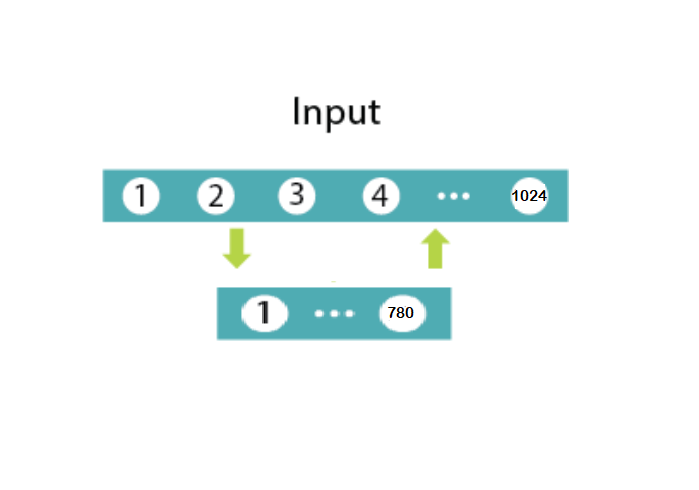
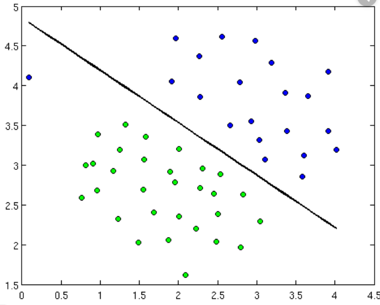
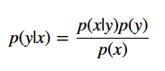

# Restricted Boltzmann Machines

### Introduction

Restricted Boltzmann Machine RBMs are flat neural networks that learn to reconstruct data independently by themselves in an unsupervised fashion. It can automatically extract meaningful features by constructing and deconstructing from a given input.

RBM is a two-layer neural network. Simply put, RBM takes the input and translates it into a set of binary values representing it in the hidden layer. These numbers can then be retranslated to reconstruct the inputs. Multiple forward and backward passes train the RBM, and a trained RBM can reveal which features are most important in pattern recognition. 

 The RBM is useful for:
 
    1. Collaborative Filtering
    2. Dimensionality reduction
    3. Classification
    3. Regression
    4. Feature learning
    5. Topic modeling 
    6. Deep Belief Networks

**Is RBM a generative or Discriminative model?**

RBM is a generative model. first,see what is different between discriminative and generative models:

Discriminative: Consider a classification problem in which we want to learn to distinguish between Sedan cars (y = 1) and SUV cars (y = 0), based on some features of cars. Given a training set, an algorithm like logistic regression tries to find a straight line—that is, a decision boundary like below—that separates the suv and sedan.

<b>Generative:</b> looking at cars, we can build a model of what Sedan cars look like. Then, looking at SUVs, we can build a separate model of what SUV cars look like. Finally, to classify a new car, we can match the new car against the Sedan model, and match it against the SUV model, to see whether the new car looks more like the SUV or Sedan. 

Generative Models specify a probability distribution over a dataset of input vectors. We can do both supervise and unsupervised tasks with generative models:
<ul>
 <li>In an unsupervised task, we try to form a model for P(x), where P is the probability given x as an input vector.</li>
    <li>In the supervised task, we first form a model for P(x|y), where P is the probability of x given y(the label for x). For example, if y = 0 indicates whether a car is a SUV or y = 1 indicates a car is a Sedan, then p(x|y = 0) models the distribution of SUVs’ features, and p(x|y = 1) models the distribution of Sedans’ features. If we manage to find P(x|y) and P(y), then we can use <code>Bayes rule</code> to estimate P(y|x), because:  </li>
 

</ul>

In this nootbook are explained:
1. Example of RBM layers
2. two phases of the RBM training
3. How to train the model (contrastive divergence and Gibbs Sampling)
4. What can RBM do after training
5. Using the German Traffic Sign Dataset to practice the usage of RBMs.
6. Visualize the hidden units 
